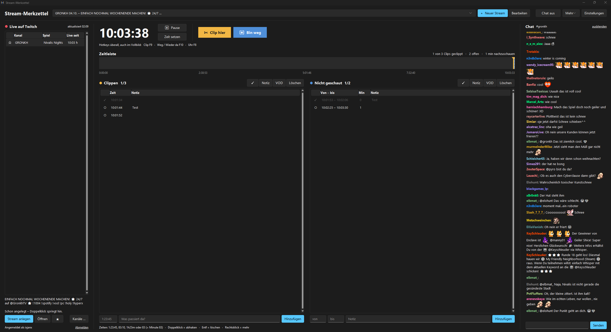

# Stream-Merkzettel

Ein kleines Windows-Programm für alle, die Streams schauen und hinterher clippen wollen.
Du markierst während des Streams per Tastendruck, wo etwas Clip-würdiges passiert ist und welche Stellen du verpasst hast – später arbeitest du die Liste in Ruhe ab.

<!-- Screenshot einfügen: Bild ins Repo legen und hier verlinken -->
<!--  -->

## Was das Programm kann

- **Clip-Stellen merken** mit einem Hotkey (Standard: F9) – funktioniert auch, wenn der Stream im Vollbild läuft
- **Verpasste Abschnitte markieren** (F10 beim Weggehen, F10 beim Zurückkommen)
- **Zeitleiste** mit allen Clips und Lücken auf einen Blick, plus Zähler „geclippt / gesamt“
- **Twitch-Anbindung:** Anmelden mit deinem Twitch-Konto, Liste deiner gefolgten Kanäle, die gerade live sind, Benachrichtigung wenn jemand live geht
- **Uhr läuft automatisch synchron** zur echten Stream-Zeit, wenn du den Stream aus der Live-Liste anlegst
- **VOD-Links automatisch:** Jeder Eintrag springt mit einem Klick an die richtige Stelle im VOD
- **Chat im Fenster** – mitlesen und schreiben, mit Emotes von Twitch, BTTV, FFZ und 7TV
- **Kanäle ausblenden oder hinzufügen**, ohne zu entfolgen bzw. ohne zu folgen
- **Dark- und Hellmodus**
- **Stream-Deck-Plugin** (optional) mit Live-Anzeige auf den Tasten

## Download & Installation

1. Unter **[Releases](../../releases)** die neueste `StreamMerkzettel.exe` herunterladen.
2. An einen festen Ort legen (z. B. `Dokumente\StreamMerkzettel`) und starten.
3. Beim ersten Start fragt das Programm, ob es eine Desktop-Verknüpfung anlegen soll.

Eine Installation ist nicht nötig, die exe läuft direkt.

### Windows-Warnung beim ersten Start

Windows zeigt bei Programmen von kleinen Entwicklern oft „Der Computer wurde durch Windows geschützt“. Das liegt daran, dass die exe nicht kostenpflichtig signiert ist. Klick auf **Weitere Informationen → Trotzdem ausführen**.

Manche Virenscanner schlagen fälschlich an, weil die globalen Hotkeys technisch die Tastatur mitlesen müssen, um F9/F10 auch im Vollbild zu erkennen. Der komplette Quellcode liegt hier im Repository – jeder kann nachsehen, dass das Programm nichts aufzeichnet oder verschickt.

## Stream-Deck-Plugin (optional)

Wer ein Elgato Stream Deck hat, kann das Plugin **„Clipp Helper“** dazu installieren. Das Programm funktioniert aber auch komplett ohne.

Zwei Wege:
- In der exe unter **Einstellungen → Stream Deck → „Stream-Deck-Plugin installieren“**
- Oder die Datei `com.xjanx.clipp-helper.streamDeckPlugin` aus den Releases herunterladen und doppelklicken

Danach gibt es in der Stream Deck Software die Kategorie „Stream-Merkzettel“ mit drei Tasten:

| Taste | Funktion | Anzeige auf der Taste |
|---|---|---|
| Clip hier | Clip-Stelle merken | geclippt / gesamt |
| Bin weg / Wieder da | Verpassten Abschnitt starten/beenden | „weg seit …“, Taste wird blau |
| Stream-Uhr | Uhr starten/pausieren | aktuelle Stream-Zeit, „LIVE“ bei Twitch-Sync |

Voraussetzung: Stream Deck Software ab Version 7.1. Das Plugin spricht nur lokal mit dem Programm (Port 8765), nichts geht ins Internet.

## Twitch-Anmeldung

Unter **„Mit Twitch anmelden“** zeigt das Programm einen Code an und öffnet Twitch im Browser. Dort bestätigen, fertig. Dabei fragt Twitch zwei Berechtigungen ab:

- **Gefolgte Kanäle lesen** – für die Live-Liste
- **Chatnachrichten senden** – damit du im eingebauten Chat schreiben kannst

Dein Passwort bekommt das Programm nie zu sehen. Die Anmeldung wird nur lokal auf deinem PC gespeichert und läuft ab, wenn du das Programm 30 Tage nicht benutzt.

## Hotkeys

| Taste | Funktion |
|---|---|
| F9 | Clip hier |
| F10 | Bin weg / Wieder da |
| F8 | Uhr Start / Pause |

Änderbar unter Einstellungen, z. B. auf `<ctrl>+<alt>+c`.

## Wo liegen meine Daten?

Alles lokal unter `%APPDATA%\StreamMerkzettel`:
- `daten.json` – deine Streams, Clips und Einstellungen
- `twitch.json` – deine Twitch-Anmeldung

Zum Sichern: im Programm unter **Mehr → Backup kopieren**.

Das Programm verbindet sich nur mit Twitch (Anmeldung, Live-Liste, Chat) und den Emote-Diensten BTTV, FFZ und 7TV (nur zum Laden der Emote-Bilder).

## Selbst bauen

Du brauchst [Python](https://www.python.org/) (beim Installieren „Add python.exe to PATH“ anhaken).

1. Repository herunterladen
2. `exe_bauen.bat` doppelklicken
3. Die fertige exe liegt im Ordner `dist`

Für eigene Builds mit Twitch-Funktion brauchst du eine eigene Client-ID: Auf [dev.twitch.tv/console](https://dev.twitch.tv/console) eine Anwendung registrieren (Client-Typ **Öffentlich**, OAuth-Redirect `http://localhost`) und die ID in `stream_merkzettel.py` bei `TWITCH_CLIENT_ID` eintragen.

Das Stream-Deck-Plugin liegt im Ordner `streamdeck-plugin` (TypeScript, Elgato Stream Deck SDK). Bauen mit `npm install`, `npm run build` und `streamdeck pack com.xjanx.clipp-helper.sdPlugin`.

## Lizenz

MIT – siehe [LICENSE](LICENSE). Du darfst das Programm frei nutzen, verändern und weitergeben.

Dieses Projekt steht in keiner Verbindung zu Twitch Interactive, Inc. oder Elgato/Corsair.
